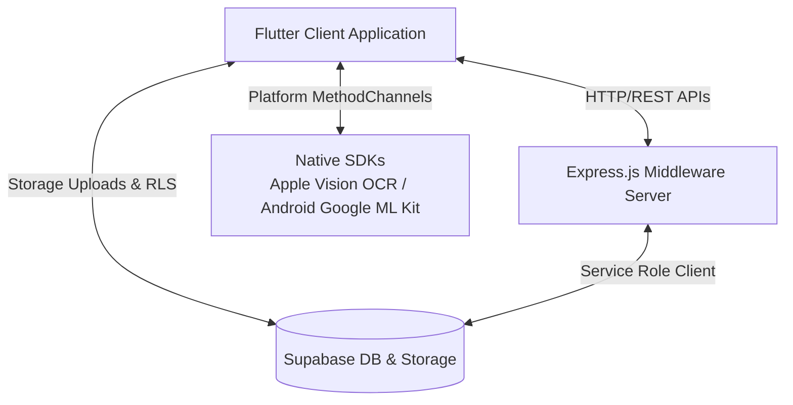
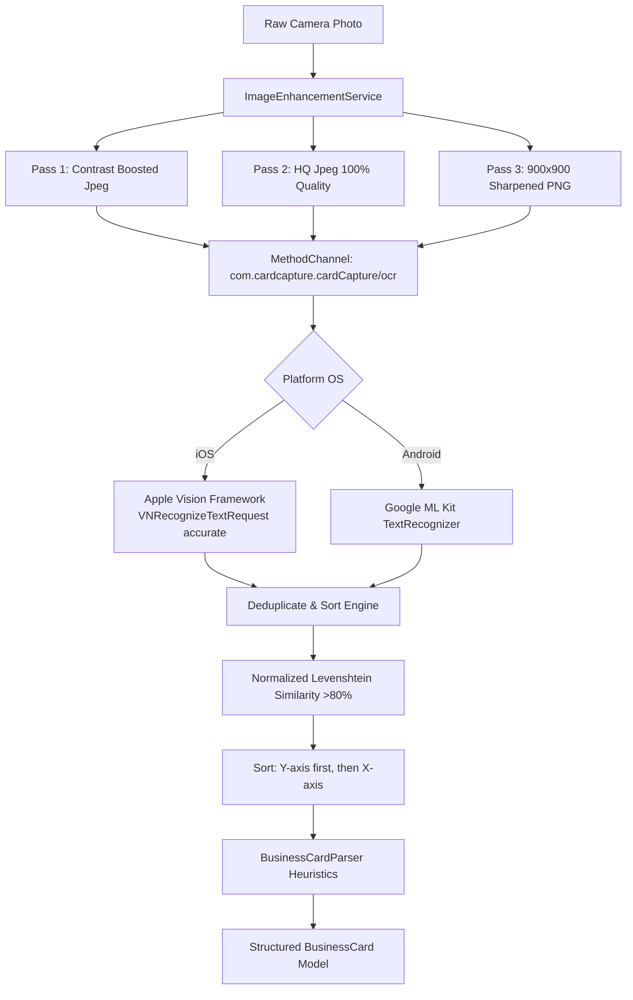

# <p align="center"></p>

<p align="center">
  <strong>Nebula</strong> — A state-of-the-art digital business card wallet, customizable canvas designer, and intelligent OCR scanner application. Built with offline-first local caching and seamless cloud synchronization.
</p>

<p align="center">
  
  
  
  
</p>

---

## 📖 Table of Contents
1. [🌟 Key Features](#-key-features)
   - [Smart OCR Scanner Engine](#1-smart-ocr-scanner-engine)
   - [Live Card Border Detection](#2-live-card-border-detection)
   - [Personal Card Designer Canvas](#3-personal-card-designer-canvas)
   - [Offline-First & Cloud Sync](#4-offline-first--cloud-sync)
   - [Interactive Statistics Dashboard](#5-interactive-statistics-dashboard)
2. [📐 System Architecture](#-system-architecture)
3. [⚙️ OCR Pipeline Mechanics](#%EF%B8%8F-ocr-pipeline-mechanics)
4. [🛠 Tech Stack](#-tech-stack)
5. [📂 Directory Layout](#-directory-layout)
6. [🗄 Database Schema & RLS](#-database-schema--rls)
7. [🌐 REST API Endpoints](#-rest-api-endpoints)
8. [⚡ Getting Started](#-getting-started)
   - [Backend Setup](#1-backend-setup)
   - [Frontend Client Setup](#2-frontend-client-setup)
9. [✨ Premium UI/UX Polish](#-premium-uiux-polish)

---

## 🌟 Key Features

### 1. Smart OCR Scanner Engine
*   **On-Device Image Analysis**: Extracts and structures information from business cards locally on the user's device.
*   **Multi-Pass Enhancement Pipeline**: Renders scanned cards into three unique processed styles (Contrast Booster, High-Quality JPEG, and Sharpness-focused PNG) before passing them to native engines.
*   **Coordinate-Based Layout Sorting**: Sorts recognized text segments vertically (Y-axis) first. If text lines fall within a 10-pixel height tolerance, they are sorted left-to-right (X-axis) to preserve logical blocks.
*   **Heuristic Text Classifier**: Evaluates and labels card lines into distinct fields (Names, Designations, Companies, Emails, Websites, Twitter/LinkedIn handles, and Addresses). Includes custom normalization patterns for Indian (+91) and international telephone formats.

### 2. Live Card Border Detection
*   **Real-Time Camera Stream Monitoring**: Analyzes active camera frames using ML Kit to locate card-like geometric shapes.
*   **Dynamic Geometric Validation**: Constrains auto-capture thresholds to standard business card aspect ratios (between $1.3$ and $2.5$).
*   **Animated Visual Guidelines**: Guides users via dynamic green bounding targets and sweep shutter animations.

### 3. Personal Card Designer Canvas
*   **Custom Layout Templates**: Features 9 preconfigured themes including `Classic`, `Dark Pro`, `Bold Split` (with automated contrasting typography adjustments), and background-gradient cards.
*   **Interactive Fluid Drag-and-Drop**: Users can tap and position contact fields (Names, Websites, Social Media links) directly on the card canvas. Coordinates are clamped inside safe margin boundaries.
*   **Dynamic Resizing Gestures**: Modify text sizes and profile photo sizes via intuitive gesture drag handles. Supports multi-shape clipping paths for profile photos (Hexagon, Diamond, Circular, Rounded Rectangle).
*   **Repaint Boundary PNG Snapshots**: Converts customized card layouts into high-resolution PNGs natively for dynamic file sharing, vCard QR generation, or database synchronization.

### 4. Offline-First & Cloud Sync
*   **Persistent SQLite/Shared-Preferences Caching**: Create, edit, browse, search, and delete business cards entirely offline.
*   **Express Sync Middleware**: Synchronizes local cached queues with the backend API middleware as soon as an internet connection is established.

### 5. Interactive Statistics Dashboard
*   **Usage Distribution**: Visualizes cards collected per company, contact counts, and scanning logs.
*   **Custom Graphs**: Responsive activity grids and bar charts representing scanning velocity trends.

---

## 📐 System Architecture

Nebula uses a split client-server architecture with direct client-storage integration for performance and database RLS integrity:



---

## ⚙️ OCR Pipeline Mechanics

Nebula implements a multi-stage text processing pipe to maximize recognition accuracy on degraded or shadowed business card pictures:



### 1. Multi-Pass Variants
To extract faint text, the system generates three helper image outputs:
*   **Pass 1**: Normalizes aspect scale, baked EXIF orientation, and applies a contrast factor of $1.1$.
*   **Pass 2**: Increases contrast factor to $1.15$ and offsets brightness to $1.05$ at maximum JPEG quality.
*   **Pass 3**: Downscales the image, applies a sharpening convolution filter, and exports to PNG to highlight text boundaries.

### 2. Deduplication & Sorting
The text lines returned by each pass are merged. Duplicate strings are removed using a **Levenshtein Distance** algorithm (similarity $> 80\%$ or text containment triggers deduplication, retaining the version with the longer length/more data). Lines are then sorted using coordinates to ensure logical reading layout.

### 3. Heuristic Field Classification
The parser classifies words sequentially using a "claimed line" mechanism:
*   **Emails**: Extracted via regular expressions. Splits/breaks across lines are stitched together.
*   **Phones**: Extracted via digital sequence patterns, removing non-digit noise.
*   **Social & Websites**: Evaluated against domain anchors. Standard email domains (e.g. gmail, yahoo) are blacklisted to avoid false website identification.
*   **Names**: Identified as the largest remaining un-claimed text block within $2-5$ words that is purely alphabetic.
*   **Company Name**: Identified by looking for common corporate suffix keywords (`Inc`, `LLC`, `Ltd`, `Co`) or capitalized lines in the top $25\%$ of the card area.
*   **Designations**: Matches against typical professional keywords (`Manager`, `Director`, `Engineer`, `CEO`, `Founder`) or falls back to the line immediately below the detected Name.
*   **Address**: Matches address keywords (`Street`, `Road`, `Avenue`, `Plot`) or valid postal ZIP codes.

---

## 🛠 Tech Stack

### Flutter Frontend (Mobile Client)
*   **State Management**: `Provider` architecture (`MultiProvider`) managing auth, scanned cards, local editing states, and card design templates.
*   **UI Animations**: `flutter_animate` (providing sequential fades, scale transformations, and elastic easing curves).
*   **Asset Branding**: Launcher icons generated using `flutter_launcher_icons` and custom vector graphic support via `flutter_svg` and `lottie`.
*   **Hardware Hooks**: `camera` for live feeds, `vibration` for haptic feedback, and `flutter_contacts` for device integration.
*   **Local Caching**: `shared_preferences` database serialization.

### Backend Node.js API
*   **API Framework**: Node.js & Express.js.
*   **Authentication**: Custom JSON Web Token (JWT) generator coupled with Supabase Auth routing.
*   **Security & Guardrails**:
    *   `helmet` for HTTP header security.
    *   `express-rate-limit` to restrict spamming.
    *   `cors` configuration for cross-origin security.
    *   `Joi` schemas payload validation.

### Database Layer
*   **Database engine**: Supabase PostgreSQL.
*   **Indexing**: Full-Text search GIN Indexes on `name` and `company` fields for fast searching.
*   **Security**: Table Row Level Security (RLS) policies linking tables back to `auth.users`.

---

## 📂 Directory Layout

```
├── android/                        # Android-specific native code & configurations
├── ios/                            # iOS-specific native code & configurations
├── assets/
│   └── images/
│       ├── Icon.png                # App Launcher Icon branding
│       └── Logo.png                # App Horizontal Logo branding
├── backend/
│   ├── src/
│   │   ├── config/                 # Supabase client instantiation & environmental validation
│   │   ├── controllers/            # Request routers (Auth, Cards, Custom Designs)
│   │   ├── middleware/             # Express route protection & validation schemas
│   │   ├── routes/                 # Express route mappings
│   │   └── services/               # DB manipulation layers & Supabase storage uploads
│   ├── server.js                   # Node.js Express entrypoint
│   └── schema.sql                  # PostgreSQL table definitions, indexing & RLS
├── lib/
│   ├── core/
│   │   ├── constants/              # Regexes, OCR keyword mappings, and app values
│   │   ├── theme/                  # Premium Violet theme styling & tokens
│   │   └── utils/                  # Permission handlers & value formatting
│   ├── data/
│   │   ├── models/                 # Dart serializable data entities
│   │   └── services/               # OCR, upload, cropping, and local cache utilities
│   ├── presentation/
│   │   ├── providers/              # ChangeNotifier classes for state synchronization
│   │   ├── screens/                # UI screen widgets (Scan, Designer, Stats, Wallet)
│   │   └── widgets/                # Reusable design modules (Custom nav, card templates)
│   └── main.dart                   # Application setup & initialization
├── test/                           # Automated Flutter test suites
└── pubspec.yaml                    # Flutter project configuration file
```

---

## 🗄 Database Schema & RLS

Nebula utilizes three core PostgreSQL tables in Supabase:

### 1. `profiles`
Extends default Supabase `auth.users` to hold profile details:
*   `id` (UUID, Primary Key, references `auth.users(id)`)
*   `email` (Text, Required)
*   `full_name` (Text)
*   `created_at` / `updated_at` (Timestamps)
*   *RLS Policies*: Users can read and update only their own profile (`auth.uid() = id`).

### 2. `business_cards`
Stores scanned/imported card details:
*   `id` (UUID, Primary Key)
*   `user_id` (UUID, references `auth.users(id)`)
*   `name` / `designation` / `company` / `email` / `website` / `address` / `linkedin` / `twitter` / `notes` (Text fields)
*   `phones` (JSONB Array)
*   *Indexing*: GIN indexes are applied to `name` and `company` fields:
    ```sql
    CREATE INDEX idx_business_cards_name ON public.business_cards USING gin(to_tsvector('english', COALESCE(name, '')));
    CREATE INDEX idx_business_cards_company ON public.business_cards USING gin(to_tsvector('english', COALESCE(company, '')));
    ```
*   *RLS Policies*: Read, write, and delete permissions are granted only when `auth.uid() = user_id`.

### 3. `my_cards`
Stores customized personal digital designer states:
*   `user_id` (UUID, Primary Key, references `auth.users(id)`)
*   `details` (JSONB map of fields)
*   `template_id` (Text)
*   `field_positions` (JSONB list of X,Y canvas coordinates)
*   `photo_shape` (Text - hexagon, circle, diamond, etc.)
*   `photo_url` / `card_image_url` (Public Supabase bucket links)
*   `text_color` (Text)
*   `visible_fields` (JSONB visibility mappings)
*   *RLS Policies*: Access restricted to owner.

---

## 🌐 REST API Endpoints

| Endpoint | Method | Middleware | Description |
| :--- | :---: | :--- | :--- |
| `/api/auth/register` | `POST` | *None* | Registers profile in Supabase and returns a JWT |
| `/api/auth/login` | `POST` | *None* | Authenticates credentials and returns user details & JWT |
| `/api/auth/google` | `POST` | *None* | Handles Google OAuth login flow |
| `/api/cards` | `GET` | `RequireAuth` | Fetches user's scanned cards (supports `?search=`) |
| `/api/cards` | `POST` | `RequireAuth` | Creates a new scanned card record |
| `/api/cards/:id` | `PUT` | `RequireAuth` | Updates specific card data |
| `/api/cards/:id` | `DELETE`| `RequireAuth` | Deletes specific card |
| `/api/my-card` | `GET` | `RequireAuth` | Retrieves the personal digital business card configuration |
| `/api/my-card` | `POST` | `RequireAuth` | Saves personal card (uploads base64 snapshots to Supabase storage) |
| `/api/my-card` | `DELETE`| `RequireAuth` | Deletes card customizations and associated images |

---

## ⚡ Getting Started

### Prerequisites
*   [Flutter SDK](https://docs.flutter.dev/get-started/install) (`^3.11.5`)
*   [Node.js](https://nodejs.org/en) (`>=18.0.0`)
*   Supabase Database instance

---

### 1. Backend Setup

1. Navigate to the `backend/` directory:
   ```bash
   cd backend
   ```
2. Install dependencies:
   ```bash
   npm install
   ```
3. Initialize environment configuration:
   Create a `.env` file in the `backend/` folder matching this schema:
   ```env
   PORT=5000
   SUPABASE_URL=https://your-project-id.supabase.co
   SUPABASE_ANON_KEY=your_supabase_anon_key
   SUPABASE_SERVICE_ROLE_KEY=your_supabase_service_role_key
   JWT_SECRET=your_jwt_signing_token_secret
   ```
4. Run schema scripts:
   Open the SQL editor on your Supabase dashboard and execute the scripts inside [schema.sql](file:///Users/subhash/Curoo/backend/schema.sql) to provision database tables, GIN indices, and RLS policies.
5. Launch development listener:
   ```bash
   npm run dev
   ```

---

### 2. Frontend Client Setup

1. Return to the root folder:
   ```bash
   cd ..
   ```
2. Pull required Flutter packages:
   ```bash
   flutter pub get
   ```
3. Generate Native App Launcher Icons (configured to use `assets/images/Icon.png`):
   ```bash
   flutter pub run flutter_launcher_icons
   ```
4. Run the project:
   Make sure you have a simulator running or a device connected, and execute:
   ```bash
   flutter run
   ```

---

## ✨ Premium UI/UX Polish

Nebula incorporates a high-end, responsive design system:
*   **Colors**: A carefully selected violet palette (`#6A3EEB`) matched with elegant surface backgrounds (`#F5F5F5` and `#1E1E1E` for dark panels).
*   **3D Interactive Stack Wallet**: Scanned cards are displayed in a 3D rotating stacked deck on the home screen. Swipe left or right with realistic dismiss gestures to browse your collection.
*   **Fluid Animations**: Every screen transition, search list loading, and canvas interaction is styled with smooth elastic transitions.
*   **Haptic Interface**: Integrated light vibration patterns trigger upon swipe gestures, drag handle movements, and scanner confirmation actions.
*   **Shimmer Loaders**: Premium skeleton frames render during background synchronization and API calls to prevent layout shifting.
